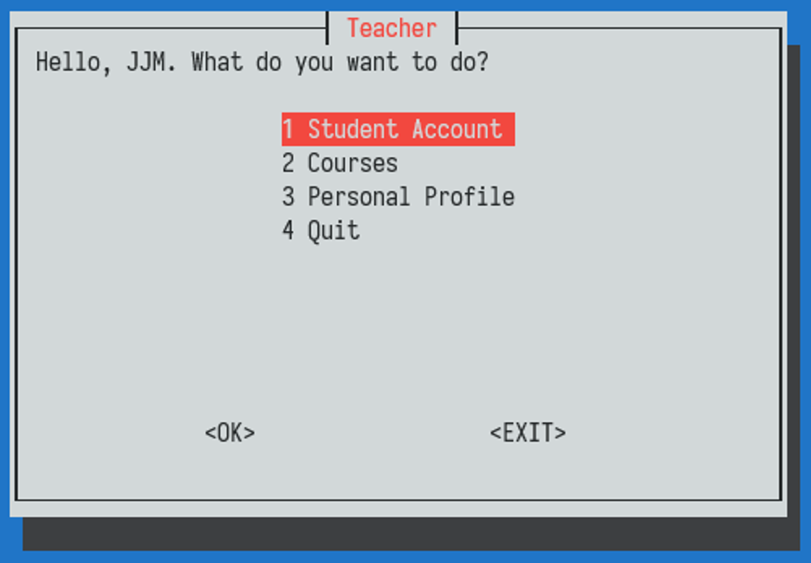

# README


[This repository](https://github.com/vtu81/HWMS) contains a **H**ome**W**ork **M**anagement **S**ystem, helping administrators, teachers and students managage courses and homework.

## File Directory

* `./HWMS`: 源代码 source code, which is an executable shell script
* `./document.pdf`: 功能描述文档 & 设计文档 description & design document
* `./assets/`: directory of demo images

详细的说明请参见该文档。Read the document to learn more.

## Quick Start & Demo

Set up your SQL account info at the first several lines in file `./HMWS`, then run:

```bash
./HWMS --initialize
```

for the first time to initialize SQL tables.

After initialization, run:

```bash
./HWMS
```

to properly start the homework management system. Then you should see a login window:


By default, there is an adminstrator account `root` with password `123456`, login with it and you should see your main menu. As an adminstrator, you can set up accounts for any other administrators, teachers and students.

Main menus for Administrator, Teacher and Student look like the following.

### Administrator

As an administrator, you can manage

* teacher accounts
* administrator accounts
* all courses
* personal profile


### Teacher

As a teacher, you can manage

* student accounts
* your courses
* personal profile



### Student

As a student, you can manage

* the courses you have chosen (and homework)
* personal profile


> Go ahead with each option, there are second and third level menus for guidance. Again, check the `document.pdf` for details.
